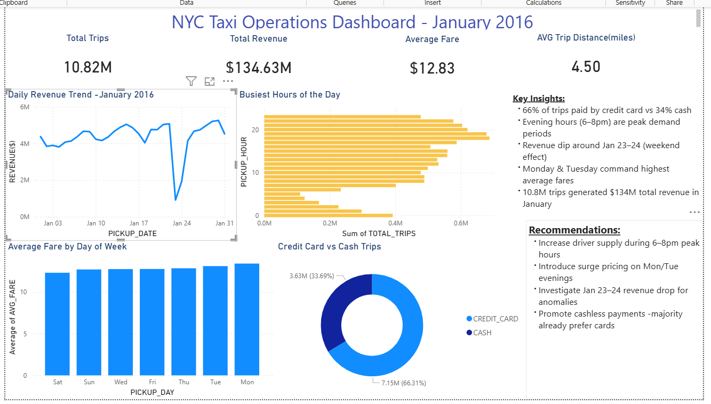

# NYC Taxi Cloud Data Pipeline 🚕

An end-to-end cloud ELT pipeline processing 10.8M+ NYC Yellow Taxi trips using Python, Snowflake, dbt, and Power BI.

---

## 📌 Project Overview

This project demonstrates a production-grade data engineering pipeline that ingests, transforms, tests, and visualizes 10.8 million NYC taxi trip records from January 2016.

Built to showcase real-world skills in cloud data warehousing, SQL transformation, data quality testing, and business intelligence.

---

## 🏗️ Architecture

Raw Data (CSV)
→ Python + Pandas (cleaning & ingestion)
→ Snowflake RAW layer (10.8M rows)
→ dbt Staging layer (cleaned + transformed)
→ dbt Mart layer (aggregated analytics)
→ Power BI Dashboard

---

## 🛠️ Tech Stack

| Tool | Purpose |
|------|---------|
| Python + Pandas | Data ingestion, cleaning, transformation |
| Snowflake | Cloud data warehouse |
| dbt Cloud | SQL transformations + data quality tests |
| Power BI | Business intelligence dashboard |
| GitHub | Version control |
| Google Colab | Development environment |

---

## 📊 Pipeline Layers

| Layer | Schema | Table | Rows | Description |
|-------|--------|-------|------|-------------|
| Raw | RAW | TAXI_TRIPS | 10,837,367 | Raw ingested data — untouched |
| Staging | STAGING | STG_TAXI_TRIPS | 10,821,889 | Cleaned, typed, enriched |
| Mart | MART | MART_DAILY_SUMMARY | 744 | Hourly aggregated metrics |

---

## 🔄 dbt Models

### Staging — stg_taxi_trips
- Converts raw string timestamps to proper TIMESTAMP format
- Filters out bad records (zero fare, zero distance, zero passengers)
- Calculates trip duration in minutes
- Extracts pickup hour, day of week, and date

### Mart — mart_daily_summary
- Aggregates 10.8M rows into 744 hourly summary records
- Calculates total trips, revenue, average fare, tips, distance
- Splits payment types (credit card vs cash)

---

## ✅ Data Quality Tests

13 automated dbt tests running on every pipeline execution:

| Test | Column | Model |
|------|--------|-------|
| not_null | pickup_datetime | stg_taxi_trips |
| not_null | fare_amount | stg_taxi_trips |
| not_null | trip_distance_miles | stg_taxi_trips |
| not_null | passenger_count | stg_taxi_trips |
| not_null | payment_type | stg_taxi_trips |
| accepted_values 1-5 | payment_type | stg_taxi_trips |
| not_null | pickup_date | mart_daily_summary |
| not_null | total_trips | mart_daily_summary |
| not_null | total_revenue | mart_daily_summary |

---

## 📈 Dashboard

### Key Metrics
- 🚕 10.82M total trips in January 2016
- 💰 $134.63M total revenue generated
- 💵 $12.83 average fare per trip
- 📍 4.50 miles average trip distance

### Key Findings
- 66% of trips paid by credit card vs 34% cash
- 6–8pm evening hours are peak demand periods
- Revenue dip around Jan 23–24 (weekend weather effect)
- Monday & Tuesday command highest average fares

### Business Recommendations
- Increase driver supply during 6–8pm peak hours
- Introduce surge pricing on Mon/Tue evenings
- Investigate Jan 23–24 revenue anomaly
- Promote cashless payments — majority already prefer cards

---

## 🗂️ Project Structure

nyc-taxi-pipeline/
- models/
  - staging/
    - stg_taxi_trips.sql
    - sources.yml
    - schema.yml
  - mart/
    - mart_daily_summary.sql
- macros/
  - generate_schema_name.sql
- dbt_project.yml
- README.md

---

## 🚀 How to Run

### Prerequisites
- Snowflake account (free trial at snowflake.com)
- dbt Cloud account (free tier at cloud.getdbt.com)
- Google Colab or Python 3.8+

### Step 1 — Install dependencies

pip install snowflake-connector-python pandas kagglehub

### Step 2 — Load raw data

Run the ingestion notebook in Google Colab:
path = kagglehub.dataset_download("elemento/nyc-yellow-taxi-trip-data")

### Step 3 — Run dbt models

dbt run → builds all models
dbt test → runs all 13 quality tests
dbt docs serve → generates documentation

---

## 📚 What I Learned

- Designing a 3-layer data architecture (raw → staging → mart)
- Writing production-quality dbt SQL transformations
- Implementing automated data quality testing with dbt
- Connecting a cloud data warehouse to BI tools
- Handling 10M+ row datasets efficiently in the cloud

---

## 👩‍💻 Author

Usha Sree Dindi

- LinkedIn: linkedin.com/in/ushasreedindi
- GitHub: github.com/ushasreedindi
- Email: usha.sree.dindi.2000@gmail.com
